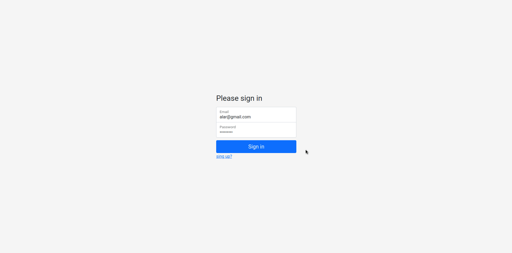

# Test App
Реализацию 2х задач обьеденил в одном сервисе. 

Загрузка начальный данных в базу происходит при сборки контейнера.
Файл дампа базы лежит в **deploy/postgresql/init**.

Json файлы для 2 задачи лежат по пути **app/data**, 
файлы связанные с этой задачей называются **source**.
Проверить можно через интерактивную документацию или через интерфейс.

Более расширенный функционал можно посмотреть и потестировать через интерактивную документацию. 
См. инструкцию ниже, а также демо инструкцию.

## Build
Соберет образы: **redis, postgresql, fastapi, nginx** 

    $ cd deploy
    $ docker-compose up --build

## Настройка local dev окружения
Что бы запустить бэк локально, 
необходимо указать верно все подключения к внешним сервисам в .env файле, расположенный ***app/.env***

### Python virtualenv
    $ sudo apt install python3-virtualenv
    $ sudo apt-get install python3-venv
    $ pip3 install virtualenv
    $ cd path/to/test_app/app
    /app $ python3 -m venv venv
    /app $ source venv/bin/activate
    /app $ pip install -r requirements.txt

### Запуск
    /app $ uvicorn main:app --reload

## Access to paths

* Основной сайт доступен по url - **http://0.0.0.0:8080/users**
* Авторизация - **http://0.0.0.0:8080/login**
* Регистрация - **http://0.0.0.0:8080/singup**
* Интерактивная документация по всем линкам доступен по url - **http://0.0.0.0:8000/docs**
* Для Авторизации использовать следующие данные:
        
      Полные права:
        email: alar@gmail.com
        password: 123456789
  
      Права на чтение:
        email: vladislavnep@gmail.com
        password: 123456789

## Stack
* FastApi
* SQLAlchemy
* PostgreSQL
* JS(JQuery)

## Demo Docs

## Demo
